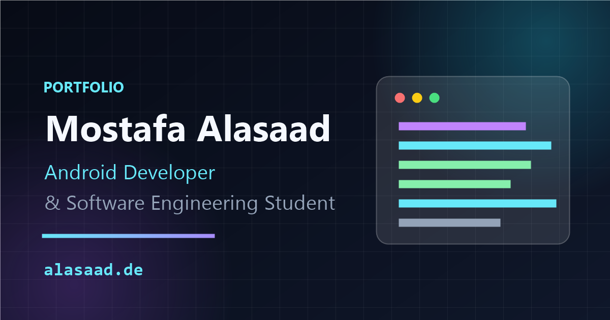

# Mostafa Alasaad — Portfolio

### Ideas into interfaces. Code into impact.

My personal portfolio as an Android developer and software engineering student based in Germany. A space for my projects, technical skills, and learning journey, featuring an interactive 3D developer workspace.

**[Visit alasaad.de](https://alasaad.de)** · [LinkedIn](https://www.linkedin.com/in/alasaad/) · [Get in touch](mailto:info@alasaad.de)

[](https://alasaad.de)

## The experience

- **Interactive 3D workspace:** a dimensional Android phone and Kotlin editor that respond to pointer movement.
- **Scroll-driven motion:** a transforming hero scene and project cards with depth, spring motion, and floating preview elements.
- **Responsive navigation:** an animated active-section indicator, reading progress bar, and mobile menu with a 3D opening transition.
- **Keyboard support:** visible focus states, Escape-to-close, focus containment, and focus restoration for the mobile dialog.
- **Motion controls:** a hero pause button, reduced-motion handling for the new interactions, and simplified dimensional effects on smaller screens.
- **Portfolio content:** projects, background, experience, skills, certificates, contact links, and a downloadable CV.
- **Static delivery:** exported HTML, social metadata, sitemap, robots.txt, and hosting security-header configuration.

The dimensional effects use **CSS perspective and Framer Motion**, without a WebGL engine or external 3D models. Project previews currently use placeholders; real application screenshots are planned for a later content update.

## Built with

| Technology | Role |
| --- | --- |
| Next.js 16 · App Router | Application structure and static export |
| React 19 · TypeScript | Components and type safety |
| Tailwind CSS 4 · CSS | Responsive styling, glass surfaces, and 3D geometry |
| Framer Motion | Scroll motion, spring interactions, and transitions |
| React Icons | Interface icons |
| Fira Code via `next/font` | Locally served code typography in the built site |
| Cloudflare Pages | Static hosting |

## Run locally

Use **Node.js 20.9 or newer** and npm. Dependency versions are recorded in `package-lock.json`.

```bash
git clone https://github.com/Mostafa2s/Portfolio.git
cd Portfolio
npm ci
npm run dev
```

Open **http://localhost:3000**. No environment variables or API keys are required for the current site.

| Command | Purpose |
| --- | --- |
| `npm run dev` | Start the development server |
| `npm run lint` | Check code with ESLint |
| `npx tsc --noEmit` | Check TypeScript types |
| `npm run build` | Build and export the site to `out/` |

The build fetches Fira Code through `next/font/google`, so the build environment needs access to Google Fonts. The resulting font files are served with the site.

## Project structure

```text
public/                     CV, social preview, robots.txt, and headers
src/
├── app/                    Page composition, metadata, sitemap, global styles
├── components/
│   ├── hero/               Introduction and interactive developer scene
│   ├── projects/           Project list and pointer-driven depth effects
│   ├── layout/             Navigation and footer
│   ├── about/              Personal background
│   ├── experience/         Learning and development timeline
│   ├── skills/             Technical and language skills
│   ├── certificates/       Certificate summaries
│   └── contact/            Contact links and availability
└── data/                   Projects, experience, skills, and certificates
```

## Updating content

- **Projects:** edit `src/data/projects.ts`. GitHub and demo buttons remain hidden while their URL is `#`.
- **Experience, skills, and certificates:** edit the corresponding files in `src/data/`.
- **Introduction and contact details:** update the relevant components in `src/components/`.
- **CV:** replace `public/Mostafa_Alasaad_CV.pdf`, keeping its filename to preserve existing links.
- **Social preview:** update `public/og-image.png` and keep its dimensions aligned with the metadata in `src/app/layout.tsx`.
- **Visual design:** shared styles and CSS 3D geometry live in `src/app/globals.css`.

## Deployment

This project uses `output: "export"`, unoptimized images, and trailing slashes in `next.config.ts`. Running `npm run build` produces the static site in **`out/`**.

Cloudflare Pages settings:

| Setting | Value |
| --- | --- |
| Build command | `npm run build` |
| Build output directory | `out` |
| Production branch | `main` |

Security headers for Cloudflare Pages are defined in `public/_headers`. The sitemap is generated as a static metadata route.

For a local production preview, serve `out/` with a static file server. The existing `npm start` script runs `next start` and is **not the preview command for this static-export configuration**.

## Next steps

- Replace project placeholders with real screenshots and updated project details.
- Continue refining section transitions and the contact experience.
- Run a full responsive and Lighthouse audit before the next release.

## Let's connect

I'm open to Ausbildung opportunities, internships, junior Android development roles, and project collaborations.

**[Website](https://alasaad.de)** · **[GitHub](https://github.com/Mostafa2s)** · **[LinkedIn](https://www.linkedin.com/in/alasaad/)** · **[Email](mailto:info@alasaad.de)**
